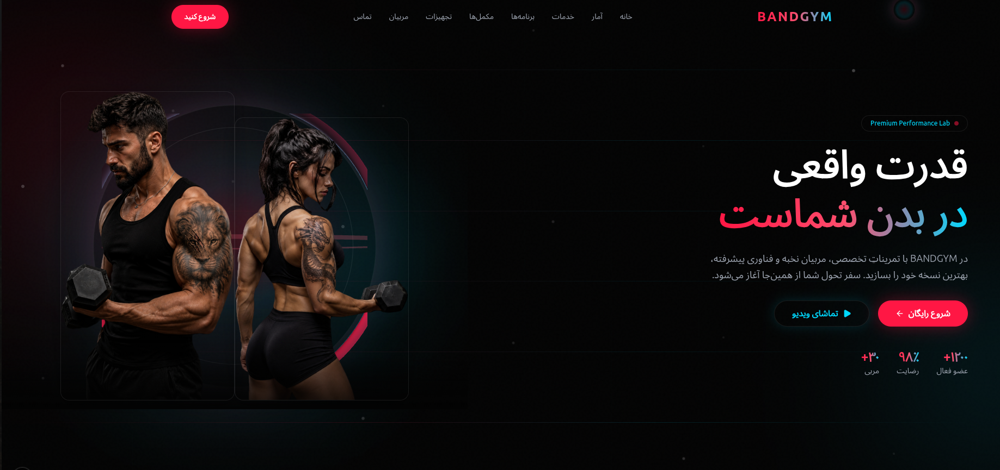

# Body Building Landing Page

A modern fitness and bodybuilding landing page built with Next.js. The project focuses on polished UI sections, smooth interactions, and a clear structure for extending content like programs, services, trainers, supplements, and apparel.



## Features

- Hero section with animated visual elements
- Trainer profiles and transformation gallery
- Workout program highlights and nutrition section
- Service cards, testimonials, FAQ, and contact section
- Product showcase sections for supplements and apparel
- Responsive layout and reusable UI components

## Tech Stack

- Next.js (App Router)
- React + TypeScript
- Tailwind CSS
- ESLint + Prettier
- Framer Motion + GSAP
- React Three Fiber / Drei (3D-related UI effects)

## Setup and Run (Development)

1. Install dependencies:

```bash
npm install
```

2. Start the development server:

```bash
npm run dev
```

3. Open the app:

`http://localhost:3000`

## Build and Start (Production)

1. Build the project:

```bash
npm run build
```

2. Start the production server:

```bash
npm run start
```

## Folder Structure (Brief)

```text
src/
  app/          # App Router entry, layout, global styles
  components/   # UI, layout, hero, and page sections
  hooks/        # Custom React hooks
  lib/          # Shared constants/utilities/image mappings
public/
  images/       # Static image assets used by the UI
```
